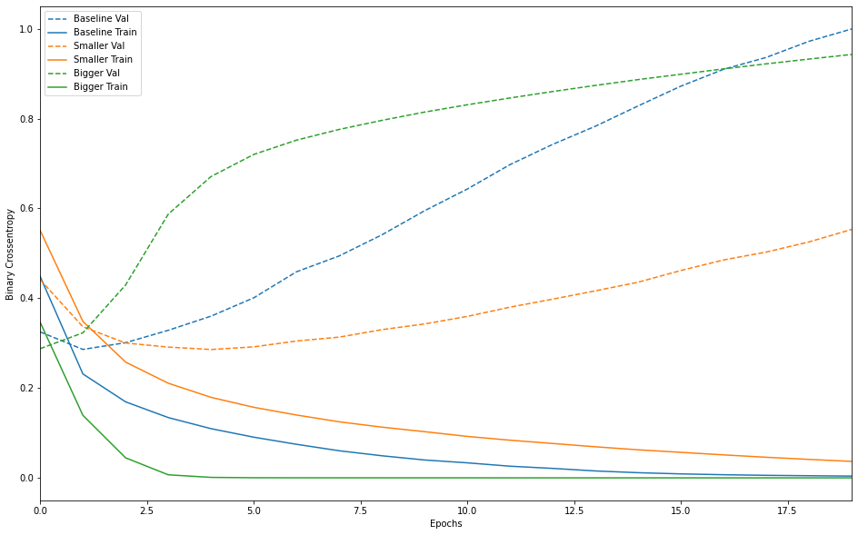

# 00\_モデルの構築と訓練

## 学ぶべき項目は以下

- TensorFlow2.0 以降を使用する。

- [tutorial1](#tutorial1)

  - [x] TensorFlow を使用して機械学習(ML)モデルの構築、コンパイル、訓練を行う。
  - [ ] データを前処理してモデルで使用できるようにする。
  - [x] モデルを使用して結果を予測する。
  - [x] 複数の層で構成されるシーケンスモデルを構築する。
  - [x] 二項分類のモデルを構築して訓練する。
  - [x] 多項分類のモデルを構築して訓練する。

- [tutorial2](#tutorial2)

  - [ ] 事前訓練されたモデルを使用する(転移学習)。
  - [ ] 事前訓練されたモデルから機能を抽出する。
  - [ ] モデルへの入力が適切な形状で行われるようにする。
  - [ ] テストデータをニューラルネットワークの入力の形状に合わせたものにする。
  - [ ] ニューラル ネットワークの出力データを、テストデータで指定された入力の形状に合わせたものにする。

- [tutorial3](#tutorial3)

  - [ ] データの一括読み込みについて理解している
  - [ ] コールバックを使用して、訓練サイクルの終了を呼び出す。
  - [ ] 複数のソースのデータセットを使用する。
  - [ ] 複数のフォーマット(json や csv など)のデータセットを使用する。
  - [ ] tf.data.datasets のデータセットを使用する。

- [過学習](#OverFitting)

  - [x] 訓練済みモデルのプロットの損失と精度を確認する。
  - [x] 拡張やドロップアウトなどの過剰適合を避けるための戦略を割り出す。

---

## <a name="tutorial1">tutorial1</a>

- [x] TensorFlow を使用して機械学習(ML)モデルの構築、コンパイル、訓練を行う。
- [x] データを前処理してモデルで使用できるようにする。
- [x] モデルを使用して結果を予測する。

```python
"""🌟 モデルの構築
"""
model = keras.Sequential([
    keras.layers.Flatten(input_shape=(28, 28)),
    keras.layers.Dense(128, activation='relu'),
    keras.layers.Dense(10, activation='softmax')
])

"""🌟 モデルのコンパイル
"""
model.compile(optimizer='adam',
              loss='sparse_categorical_crossentropy',
              metrics=['accuracy'])

"""🌟 モデルの訓練
"""
model.fit(train_images, train_labels, epochs=5)

"""🌟 モデルの正解率の評価
"""
test_loss, test_acc = model.evaluate(test_images,  test_labels, verbose=2)
print('Test accuracy:', test_acc)

"""
    🌟 予測
        - 入力には入力の配列を入れる必要がある。
        - 多項分類の場合、10個の配列で渡される。
          10個の中から最大値のインデックスを指定して予測結果とする。
        - 二項分類の場合、1つの数字(確率)で渡される。
"""
predictions = model.predict(test_images)
np.argmax(predictions[0])

```

- [x] 複数の層で構成されるシーケンスモデルを構築する。
- [x] 二項分類のモデルを構築して訓練する。
- [x] 多項分類のモデルを構築して訓練する。

### 二項分類

```python
# 入力の形式は映画レビューで使われている語彙数（10,000語）
vocab_size = 10000

"""
    🌟 二項しかないため、0,1をどちらかに割り振って
    🌟 softmaxで0~1の値となるようにする。(おそらく多項分類の二項にしてもいいんじゃないかな？)
"""

model = keras.Sequential()
model.add(keras.layers.Embedding(vocab_size, 16))
model.add(keras.layers.GlobalAveragePooling1D())
model.add(keras.layers.Dense(16, activation='relu'))
model.add(keras.layers.Dense(1, activation='sigmoid'))

"""
    🌟 二値分類問題であり、モデルの出力は確率（1ユニットの層とシグモイド活性化関数）の場合、
    🌟 binary_crossentropyを使える。
    (回帰問題(家屋の値段を推定するとか)の場合、mean_squared_error（平均二乗誤差）を使うこともできる。)
"""

model.compile(optimizer='adam',
              loss='binary_crossentropy',
              metrics=['accuracy'])
```

### 多項分類

- 以下のように、出力層を多項数だけ用意し、loss 関数に適切な関数を指定すれば OK

```python
"""
    🌟 多項分類のため、出力層を求めるクラスの数だけ出力させ、
    🌟 softmaxで0~1の値となるようにする必要がある。
"""
model = keras.Sequential([
    keras.layers.Flatten(input_shape=(28, 28)),
    keras.layers.Dense(128, activation='relu'),
    keras.layers.Dense(10, activation='softmax')
])

"""
    🌟 多項分類においてloss関数の評価は多項分の評価にあったものを選ぶ必要がある。
    今回の場合、以下などが選ばれる。
        sparse_categorical_crossentropy
"""

model.compile(optimizer='adam',
              loss='sparse_categorical_crossentropy',
              metrics=['accuracy'])
```

### 回帰問題

```python
def build_model():
  model = keras.Sequential([
    layers.Dense(64, activation='relu',
        # tuple or list形式で渡す必要がある。(数字)だとtupleと認識しないので(数字,)とすることで1Dで渡すことができる。
        input_shape=[len(train_dataset.keys())]),
    layers.Dense(64, activation='relu'),
    layers.Dense(1)
  ])

  optimizer = tf.keras.optimizers.RMSprop(0.001)

  """
    🌟 loss関数にmse(mean_squared_error（平均二乗誤差))を指定することで、評価している。
    🌟 metricにはmse,maeとかを選択する。
  """
  model.compile(loss='mse',
                optimizer=optimizer,
                metrics=['mae', 'mse'])
  return model
```

---

## <a name="tutorial2">tutorial2</a>

- [ ] 事前訓練されたモデルを使用する(転移学習)。
- [ ] 事前訓練されたモデルから機能を抽出する。
- [ ] モデルへの入力が適切な形状で行われるようにする。
- [ ] テストデータをニューラルネットワークの入力の形状に合わせたものにする。
- [ ] ニューラル ネットワークの出力データを、テストデータで指定された入力の形状に合わせたものにする。

```python

```

---

## <a name="tutorial3">tutorial3</a>

- [ ] データの一括読み込みについて理解している
- [x] [コールバックを使用して、訓練サイクルの終了を呼び出す。](#Callback)
- [ ] 複数のソースのデータセットを使用する。
- [ ] 複数のフォーマット(json や csv など)のデータセットを使用する。
- [ ] tf.data.datasets のデータセットを使用する。

```python

```

- <a name="Callback">コールバック</a>

  - [コールバック関連リンク](https://www.tensorflow.org/api_docs/python/tf/keras/callbacks/Callback)

  - EarlyStop の他にも学習率、checkpoint の保存、tensorboard へのアウトプットなどができるコールバックも用意されてる。

```python

# 🌟 コールバックを作る際はこんな感じでCallbackクラスを継承して作成する。
class PrintDot(keras.callbacks.Callback):
  # エポックが終わるごとにドットを一つ出力することで進捗を表示
  def on_epoch_end(self, epoch, logs):
    if epoch % 100 == 0: print('')
    print('.', end='')


# 🌟🌟 メトリックに改善が見られない場合に終了するコールバック
# patience は改善が見られるかを監視するエポック数を表すパラメーター
early_stop = keras.callbacks.EarlyStopping(monitor='val_loss', patience=10)

history = model.fit(
    normed_train_data,
    train_labels,
    epochs=EPOCHS,
    validation_split = 0.2,
    verbose=0,
    callbacks=[early_stop, PrintDot()])

```

---

## <a name="OverFitting">過学習</a>

### 過学習の対策に以下が有効と言われている。

- [x] [訓練データを増やす(**データの改善**)](#DataExpand)
- [x] [data 拡張を実行(**データの改善**)](#DataExpand)
- [x] [dropout 層追加(**モデル側の改善策**)](#dropOut)
- [x] [network の容量を減らす(**モデル側の改善策**)](#SmallModel)
- [x] [**重みの正則化**(L1 正則化、L2 正則化などをして過学習を防ぐ)](#norm)
- [ ] バッチ正規化

---

- <a name="DataExpand">訓練データを増やす& data 拡張を実行(**データの改善**)</a>

  - 訓練データを増やす、data 拡張を実行はほぼ同義なので、まとめて記載する。

    - **「訓練データを増やす」** そのままの意味

  - **data 拡張を実行** は下記に示す。

- <a name="dropOut">dropout 層追加(**モデル側の改善策**)</a>

  - **訓練時**に層から出力された特徴量に対してランダムに「ドロップアウト（つまりゼロ化）」を行うもの`ドロップアウト率`は概ね `0.2 ~ 0.5` が目安と言われている。

  ```python
  # 🌟 使い方 これをモデルの層に追加していくだけ。
  keras.layers.Dropout(0.5),
  ```

- <a name="SmallModel">network の容量を減らす(**モデル側の改善策**)</a>

  - パラメータ数が多いと余計な条件に引っかかるようになり、増えすぎることで汎化性能が下がっていく(test データでは高い正解率にも関わらず、validation check にて低いスコアが出てしまう。(**過学習**))
  - セオリーとして小さいモデル、大きいモデルの丁度いいところを探す必要がある。

- 以下に例を示す。

```python
# -------------------------------------------- #
# 🌟　普通のモデル
baseline_model = keras.Sequential([
    # `.summary` を見るために`input_shape`が必要
    keras.layers.Dense(16, activation='relu', input_shape=(NUM_WORDS,)),
    keras.layers.Dense(16, activation='relu'),
    keras.layers.Dense(1, activation='sigmoid')
])

baseline_model.compile(optimizer='adam',
                       loss='binary_crossentropy',
                       metrics=['accuracy', 'binary_crossentropy'])

baseline_model.summary()
baseline_history = baseline_model.fit(train_data,
                                      train_labels,
                                      epochs=20,
                                      batch_size=512,
                                      validation_data=(test_data, test_labels),
                                      verbose=2)

# -------------------------------------------- #
# 🌟　小さいモデル
smaller_model = keras.Sequential([
    keras.layers.Dense(4, activation='relu', input_shape=(NUM_WORDS,)),
    keras.layers.Dense(4, activation='relu'),
    keras.layers.Dense(1, activation='sigmoid')
])

smaller_model.compile(optimizer='adam',
                      loss='binary_crossentropy',
                      metrics=['accuracy', 'binary_crossentropy'])

smaller_model.summary()

smaller_history = smaller_model.fit(train_data,
                                    train_labels,
                                    epochs=20,
                                    batch_size=512,
                                    validation_data=(test_data, test_labels),
                                    verbose=2)
# -------------------------------------------- #
# 🌟　大きいモデル
bigger_model = keras.models.Sequential([
    keras.layers.Dense(512, activation='relu', input_shape=(NUM_WORDS,)),
    keras.layers.Dense(512, activation='relu'),
    keras.layers.Dense(1, activation='sigmoid')
])

bigger_model.compile(optimizer='adam',
                     loss='binary_crossentropy',
                     metrics=['accuracy','binary_crossentropy'])

bigger_model.summary()
bigger_history = bigger_model.fit(train_data, train_labels,
                                  epochs=20,
                                  batch_size=512,
                                  validation_data=(test_data, test_labels),
                                  verbose=2)
# -------------------------------------------- #


# 🌟 大中小のモデルのbinary_crossentropy,epochを表示する関数
def plot_history(histories, key='binary_crossentropy'):
    plt.figure(figsize=(16,10))

    for name, history in histories:
        val = plt.plot(history.epoch, history.history['val_'+key],
                        '--', label=name.title()+' Val')
        plt.plot(history.epoch, history.history[key], color=val[0].get_color(),
             label=name.title()+' Train')

    plt.xlabel('Epochs')
    plt.ylabel(key.replace('_',' ').title())
    plt.legend()

    plt.xlim([0,max(history.epoch)])

# 🌟モデルのhistryを渡す
plot_history([('baseline', baseline_history),
              ('smaller', smaller_history),
              ('bigger', bigger_history)])

```

- 大、中、小モデルの実行結果

  - Baseline と Bigger の train,val が早々に乖離して過学習を起こしていることが分かる。
    

<a name=norm>重みの正則化を加える</a>

## 重みの正則化を加える

- 「単純なモデル」とは、パラメータ値の分布のエントロピーが小さいもの（パラメータの数が少ないもの）です。  
  したがって、過学習を緩和するための一般的な手法は、重みが小さい値のみをとることで、重み値の分布がより整然となる（正則）様に制約を与えるものです。
- これを**「重みの正則化」**と呼ばれ、**ネットワークの損失関数に、重みの大きさに関連するコストを加える**ことで行われます。このコストには 2 つの種類があります。

  1. L1 正則化 重み係数の絶対値に比例するコストを加える（重みの「L1 ノルム」と呼ばれる）。
  2. L2 正則化 重み係数の二乗に比例するコストを加える（重み係数の二乗「L2 ノルム」と呼ばれる）。L2 正則化はニューラルネットワーク用語では重み減衰（Weight Decay）と呼ばれる。呼び方が違うので混乱しないように。重み減衰は数学的には L2 正則化と同義である。

- L1 正則化は重みパラメータの一部を 0 にすることでモデルを疎にする効果があります。
- L2 正則化は重みパラメータにペナルティを加えますがモデルを疎にすることはありません。

  - L2 正則化のほうが一般的である理由の一つです。

- l2(0.001)というのは、**層の重み行列の係数全てに対して 0.001x 重み係数の値^2 をネットワークの損失値合計に加えることを意味します。**

- **このペナルティは訓練時のみに加えられる** ため、**このネットワークの損失値は、訓練時にはテスト時に比べて大きくなる**ことに注意してください

```python
l2_model = keras.models.Sequential([
    keras.layers.Dense(16,
        # 🌟 パラメタに l2を指定することで正規化を行う
        kernel_regularizer=keras.regularizers.l2(0.001),
        activation='relu', input_shape=(NUM_WORDS,)),
    keras.layers.Dense(16,
        kernel_regularizer=keras.regularizers.l2(0.001),
        activation='relu'),
    keras.layers.Dense(1, activation='sigmoid')
])
```
