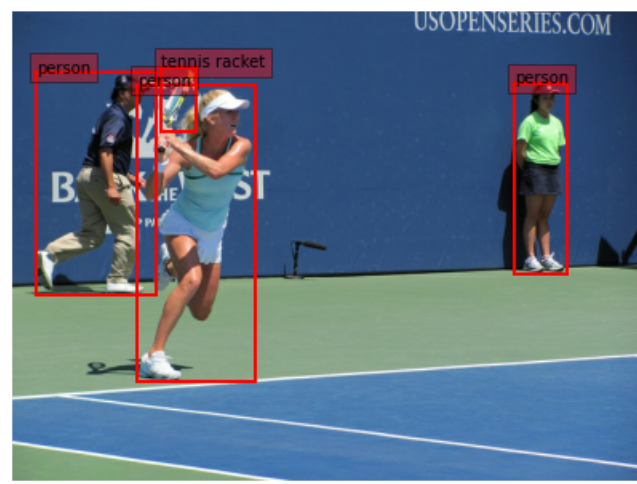

# 物体検出データセット

## COCO_2017

### 取得方法

```python
import zipfile

import tensorflow as tf
from tensorflow import keras

url = "https://github.com/srihari-humbarwadi/datasets/releases/download/v0.1.0/data.zip"
filename = os.path.join(os.getcwd(), "data.zip")
filepath = keras.utils.get_file(filename, url)


with zipfile.ZipFile(filepath, "r") as z_fp:
    z_fp.extractall("./")

```

### 読み込み方

```python
import tensorflow_datasets as tfds

🌟
(train_dataset, val_dataset), dataset_info = tfds.load(
    "coco/2017", split=["train", "validation"], with_info=True, data_dir="data"
)
```

### データセットの中身について

```python
print(dataset_info)
#🌟 ざっとこんな感じ
"""出力内容
features=FeaturesDict({
    'image': Image(shape=(None, None, 3), dtype=tf.uint8),
    'image/filename': Text(shape=(), dtype=tf.string),
    'image/id': tf.int64,
    'objects': Sequence({
        # 使い方わからん。。
        'area': tf.int64,
        # 🌟🌟 このクラスは(ymin_r,xmin_r,ymax_r,xmax_r)で格納されてるっぽい
        # 画像のピクセル単位でなく、比率(%)単位
        'bbox': BBoxFeature(shape=(4,), dtype=tf.float32),
        # 使い方わからん。。
        'id': tf.int64,
        # 使い方わからん。。。。
        'is_crowd': tf.bool,
        # 🌟🌟 ClassLabelであることに注目！！
        'label': ClassLabel(shape=(), dtype=tf.int64, num_classes=80),
    })
}),
"""

""" 🌟🌟 datasetinfoからlabelのDecorderが取れる 🌟🌟
"""

int2str = dataset_info.features["objects"]["label"].int2str
[print(int2str(idx)) for idx in adata["objects"]["label"]]
```

### 上記より、画像にアノテーション付きで表示する

```python
# Decorder
labelDecorder = dataset_info.features["objects"]["label"].int2str
# Encoder
labelEncorder = dataset_info.features["objects"]["label"].str2int

def dataSetVisualize(data):
    plt.figure(figsize=figsize)
    plt.axis("off")
    
    # 🌟画像をnp.arrayへ変換
    image = np.array(data["image"], dtype=np.uint8)
    # bboxを画像サイズに戻すため、画像サイズ取得
    yh,xw,ch =data["image"].shape
    plt.imshow(image)
    ax = plt.gca()

    # 🌟画像の高さ、幅をかけることで(元のピクセルの位置に変換する)
    bboxes = data["objects"]["bbox"]*np.array([yh,xw,yh,xw])
    labels = data["objects"]["label"]
    
    for box, label in zip(bboxes,labels):
        text = "{}".format(labelDecorder(label))
        y1, x1, y2, x2 = box
        w, h = x2 - x1, y2 - y1
        patch = plt.Rectangle(        
            [x1, y1], w, h, fill=False, edgecolor="red", 
            linewidth="2"
        )
        ax.add_patch(patch)
        ax.text(
            x1,y1,text,
            bbox={
                "facecolor": "red",
                "alpha": 0.4},
            clip_box=ax.clipbox,
            clip_on=True,
        )

for data in train_dataset.shuffle(10).take(2):
    adata = data 
    dataSetVisualize(data)
```

