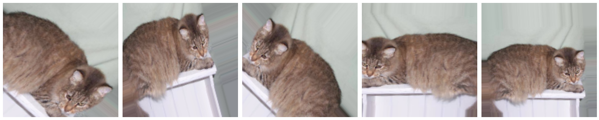

# 01\_画像の分類

- [tutorial1](#1)

  - [x] Conv2D とプーリング層で畳み込みニューラル ネットワークを定義する。
  - [x] リアルワールド画像のデータセットを処理するモデルを構築して訓練する。
  - [x] 畳み込みを使用してニューラル ネットワークを改善する方法について理解している。
    - おそらくデータの`拡張`、`dropout`などの`under fitting`, `over fitting` の対策についての問題
      - [00\_モデルの構築と訓練](../00_モデルの構築と訓練)にまとめる。

- [tutorial2](#2)

  - [x] [**ImageDataGenerator** さまざまな形状やサイズのリアルワールド画像を使用する。](#ImageDataGenerator)

    - 画素数、channel 数の違うデータの扱いのこと？

  - [x] 画像の拡張を使用して過剰適合を回避する。
  - [x] ImageDataGenerator を使用する。
  - [x] ImageDataGenerator を使用して、ディレクトリ構造に基づいて画像にラベルを付ける方法について理解している。

---

## <a name="1">tutorial1</a>

### model の構築からコンパイルまで

```python
import tensorflow as tf
from tensorflow.keras import datasets, layers, models

# -------------------------------------------- #
# 🌟 Step1 modelの構築 方法

# 🌟🌟 モデルの定義1(後からaddしていく方法)
model = models.Sequential()

# Convレイヤー
model.add(layers.Conv2D(32, (3, 3), activation='relu', input_shape=(28, 28, 1)))
model.add(layers.MaxPooling2D((2, 2)))
model.add(layers.Conv2D(64, (3, 3), activation='relu'))
model.add(layers.MaxPooling2D((2, 2)))
model.add(layers.Conv2D(64, (3, 3), activation='relu'))

# Poolingレイヤー
model.add(layers.Flatten())
model.add(layers.Dense(64, activation='relu'))
model.add(layers.Dense(10, activation='softmax'))

# --------------------------- #
# 🌟🌟 モデルの定義2(一括で定義する方法)
model = Sequential([
    Conv2D(16, 3, padding='same', activation='relu', input_shape=(IMG_HEIGHT, IMG_WIDTH ,3)),
    MaxPooling2D(),
    Conv2D(32, 3, padding='same', activation='relu'),
    MaxPooling2D(),
    Conv2D(64, 3, padding='same', activation='relu'),
    MaxPooling2D(),
    Flatten(),
    Dense(512, activation='relu'),
    Dense(1, activation='sigmoid')
])

# -------------------------------------------- #
# 🌟 Step2　コンパイル(だいたいこんな感じ)
# 作成したモデルはこのままでもpredictはできるが、fittingしてトレーニングをする必要がある。
model.compile(
    # 最適化関数
    optimizer='adam',
    # 損失関数
    loss='sparse_categorical_crossentropy',
    # watchするパラメータ
    metrics=['accuracy'])

# -------------------------------------------- #
# 🌟 Step3 fitting
# ポイントとしては、バッチサイズ、epoch数、
# training dataとvalidation data　を使うかといった観点を考える必要がある。

# これ
model.fit(train_images, train_labels, epochs=5)

# または こんな感じ
history = model.fit_generator(
    train_data_gen,
    steps_per_epoch=total_train // batch_size,
    epochs=epochs,
    validation_data=val_data_gen,
    validation_steps=total_val // batch_size
)

# -------------------------------------------- #
# Step4 🌟モデルを動かして結果を得る

# モデルの評価をしてくれる関数 戻り値からmetricを取得できる。
test_loss, test_acc = model.evaluate(test_images,  test_labels, verbose=2)

# まぁ、こんな感じ　 input_shape = (x,y,z)に対して入力するデータ数をnとすると、
# (n, x, y, z)が入力となるように整える。
# 分類の場合、各クラスの確率となるのでindexの最大値を取る
num = 10
res = model.predict(test_images[:num])

for i in range(len(res)):
    print(res[i].argmax() , " == " , test_labels[i]," : ",res[i].argmax() == test_labels[i])
```

## <a name="2">tutorial2</a>

## <a name="ImageDataGenerator">ImageDataGenerator</a>

- 画像を適切に前処理された状態にしていく(一連の流れは ImageDataGenerator がやってくれる)

  1. ディスクから画像を読み取ります。
  2. これらの`画像のコンテンツをデコードし、RGB 値にしたがって適切なグリッド形式に変換`します。
  3. それらを浮動小数点テンソルに変換します。
  4. ニューラルネットワークは小さな入力値を扱う方が適しているため、`テンソルを 0〜255 の値から 0〜1 の値にリスケーリング`します。

  5. [また、ImageDataGenerator にはデータの拡張機能も備わっていて、以下の操作を画像に施すことができる](#ImageExpand)
     - 水平反転の適用
     - 画像のランダムな回転
     - ズームによるデータ拡張の適用

- [ImageDataGenerator リンク](https://www.tensorflow.org/api_docs/python/tf/keras/preprocessing/image/ImageDataGenerator)
- [flow_from_directory リンク](https://www.tensorflow.org/api_docs/python/tf/keras/preprocessing/image/ImageDataGenerator#flow_from_directory)

```python
# ImageDataGenerator生成
# 🌟 "data_format"オプションから"channel first/last"を選択できる
train_image_generator = ImageDataGenerator(rescale=1./255) # 学習データのジェネレータ
validation_image_generator = ImageDataGenerator(rescale=1./255) # 検証データのジェネレータ
```

- こんな感じの構成のデータセットを考える。

```sh
/Users/user/.keras/datasets/cats_and_dogs_filtered
├── train
│   ├── cats
│   └── dogs
└── validation
    ├── cats
    └── dogs

6 directories
```

```python
# 🌟 flow_from_directoryからディレクトリを指定して画像を
train_data_gen = train_image_generator.flow_from_directory(
    batch_size=batch_size,
    directory=train_dir, # 🌟trainのパスを指定
    shuffle=True,
    target_size=(IMG_HEIGHT, IMG_WIDTH),
    class_mode='binary'
    )

val_data_gen = validation_image_generator.flow_from_directory(
    batch_size=batch_size,
    directory=validation_dir, # validation のパスを指定
    target_size=(IMG_HEIGHT, IMG_WIDTH),
    # 🌟 class_mode で どのような分類かをしているす
    # "categorical", "binary", "sparse", "input", or None.
    # Default: "categorical".
    class_mode='binary'
    )

```

## <a name="ImageExpand">画像の拡張</a>

```python
image_gen_train = ImageDataGenerator(
                    rescale=1./255,  # リスケール
                    rotation_range=45,  # 左右45degの範囲で回転
                    width_shift_range=.15, # 幅シフト
                    height_shift_range=.15, # 高さシフト
                    horizontal_flip=True,  # 水平反転
                    zoom_range=0.5  # ズーム
                    )
```

- こんなイメージ
  
