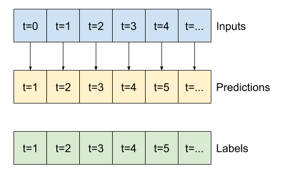
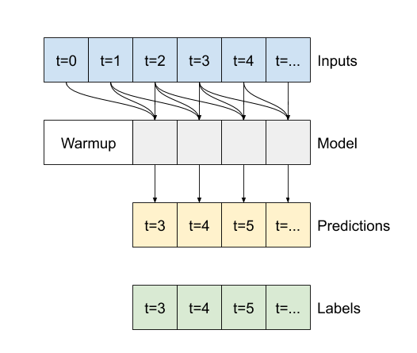

# 03\_時系列、シーケンス、予測

## [pandas 周り使い方](pandas)

## [tutorial1](#1)

- [ ] 時系列モデル、シーケンス モデル、予測モデルを訓練、調整、使用する。
- [ ] 単変量時系列と多変量時系列の値をどちらも予測できるよう訓練する。
- [ ] 時系列学習で使用するデータを準備する。
- [ ] 平均絶対誤差(MAE)と、それを使用してシーケンス モデルの精度を評価する方法について理解する。
- [ ] 時系列モデル、シーケンス モデル、予測モデルで、RNN および CNN を使用する。
  - 以下に主なモデルを挙げる
    - [線形モデル](#liner)
    - [Multi-step dense](#dense)
    - [畳み込みニューラルネットワーク(CNN)](#CNN)
    - [リカレントニューラルネットワーク(RNN)](#RNN)

- [ ] 追跡ウィンドウまたは中央ウィンドウのどちらを使用すべきかを特定する。

- 誤訳？

- [ ] TensorFlow を使用して予測を行う。
- [ ] 機能とラベルを準備する。
- [ ] シーケンスのバイアスを特定して補完する。
- [ ] 時系列モデル、シーケンス モデル、予測モデルでの学習率を動的に調整する。

---

### <a name=liner>線形モデル</a>

```python

""" 🌟 線形モデル(作成例)
"""
linear = tf.keras.Sequential([

    # 🌟こんな感じでレイヤーを増やすことのもOK(線形ではないが)
    # tf.keras.layers.Dense(units=64, activation='relu'),
    # tf.keras.layers.Dense(units=64, activation='relu'),
    tf.keras.layers.Dense(units=1)
])
```

- 1 データに対して次の時間の期待値を出力するモデル。
- 前後関係に影響なく 1 データから出力される。



- 線形モデルの`利点の1つ`は、`解釈が比較的簡単`なことです。レイヤーの重みを引き出して、各入力に割り当てられた重みを視覚化できます。

```python
plt.bar(x = range(len(train_df.columns)),
        height=linear.layers[0].kernel[:,0].numpy())
axis = plt.gca()
axis.set_xticks(range(len(train_df.columns)))
_ = axis.set_xticklabels(train_df.columns, rotation=90)
```


### <a name=dense>Multi-step dense モデル</a>

```python
multi_step_dense = tf.keras.Sequential([
    # Shape: (time, features) => (time*features)
    """
    🌟 モデルの最初のレイヤーとしてtf.keras.layers.Flattenを追加することにより、
    複数入力ステップウィンドウでdenseモデルをトレーニングできます。
    """
    tf.keras.layers.Flatten(),
    tf.keras.layers.Dense(units=32, activation='relu'),
    tf.keras.layers.Dense(units=32, activation='relu'),
    tf.keras.layers.Dense(units=1),
    # Add back the time dimension.
    # Shape: (outputs) => (1, outputs)
    tf.keras.layers.Reshape([1, -1]),
])
```


### <a name=CNN>畳み込みニューラルネットワークモデル</a>

- **`Multi-step dense モデル`** と同じで各予測への入力として複数のタイムステップを取るモデル。

- `tf.keras.layers.Flatten`と最初の`tf.keras.layers.Dense`は、  
`tf.keras.layers.Conv1D`に置き換えられます。

```python
conv_model = tf.keras.Sequential([
    tf.keras.layers.Conv1D(filters=32,
                           kernel_size=(CONV_WIDTH,),
                           activation='relu'),
    tf.keras.layers.Dense(units=32, activation='relu'),
    tf.keras.layers.Dense(units=1),
])
```



### <a name=RNN>リカレントニューラルネットワーク</a>

- `リカレントニューラルネットワーク（RNN）`は、時系列データに適したニューラルネットワークの一種です。 RNNは時系列を段階的に処理し、時間ステップごとに内部状態を維持します

- ここでは、`Long Short-Term Memory（ tf.keras.layers.LSTM ）`と呼ばれるRNNレイヤーを使用します
  - **重要なポイント**として コンストラクター引数の **`return_sequences`** 引数がある。
  これは`true/false`を設定し、戻り値の出力を制御するパラメータである。

    - `LSTM return_sequences= false`の場合
      - レイヤーは最後のタイムステップの出力のみを返し、`単一の予測を行う前にモデルに内部状態をウォームアップする`時間を与えます

    

    - `LSTM return_sequences= true`の場合
      - レイヤーは入力ごとに出力を返します。
        - 以下のメリットがある。
          - RNNレイヤーのスタッキング。
          - 複数のタイムステップで同時にモデルをトレーニングします

    
