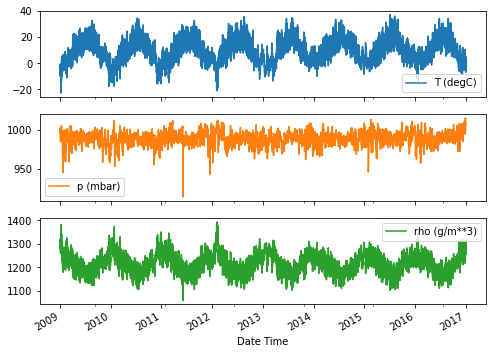
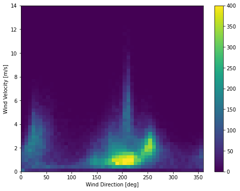

# pandas 便利な使い方まとめ

## 日付の文字列を datetime に変換する

```python
df = pd.read_csv(csv_path)
# Slice [start:stop:step], starting from index 5 take every 6th record.
df = df[5::6]

# 🌟 こんな感じですることで、
# 文字列をdatetimeで読み込むことができる。
date_time = pd.to_datetime(df.pop('Date Time'), format='%d.%m.%Y %H:%M:%S')

# 🌟　こうすることで、datetimeのクラスから、floatのtimestamp(seconds)に変換できる
timestamp_s = date_time.map(pd.Timestamp.timestamp)
```

## グラフ作成系

- index 系列でグラフを書く

```python
plot_cols = ['T (degC)', 'p (mbar)', 'rho (g/m**3)']
plot_features = df[plot_cols]
plot_features.index = date_time

## こう書くことで、subplotでグラフをかける
_ = plot_features.plot(subplots=True)
```



- heatmap を作成する。

```python
# hist2d でheatmapっぽいのが作れるのか。。結構便利かも
plt.hist2d(df['wd (deg)'], df['wv (m/s)'], bins=(50, 50), vmax=400)
plt.colorbar()
plt.xlabel('Wind Direction [deg]')
plt.ylabel('Wind Velocity [m/s]')
```


