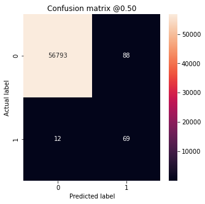
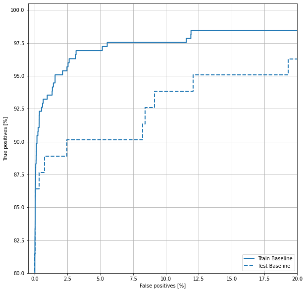
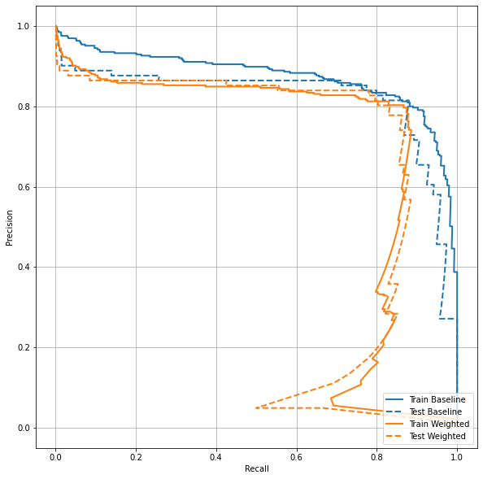

# 不均衡なデータの検証

- このページでは不均衡なデータセットのサンプリングに対するアプローチ方法をまとめます。

- [混同行列(Confusion Matrix)](#Confusion)
- [ROCプロット](#ROC)
  - 出力しきい値を調整するだけでモデルが到達できるパフォーマンスの範囲を一目で示す
  2値問題などで閾値を決めることなどに使える。
- [AUPRCプロット](#AUPRC)

---

```python
"""🌟 色々なメトリクス"""
METRICS = [
      keras.metrics.TruePositives(name='tp'),
      keras.metrics.FalsePositives(name='fp'),
      keras.metrics.TrueNegatives(name='tn'),
      keras.metrics.FalseNegatives(name='fn'), 
      keras.metrics.BinaryAccuracy(name='accuracy'),
      keras.metrics.Precision(name='precision'),
      keras.metrics.Recall(name='recall'),
      keras.metrics.AUC(name='auc'),
      keras.metrics.AUC(name='prc', curve='PR'), # precision-recall curve
]
```

- Accuracy: $\frac{\text{true samples}}{\text{total samples}}$
  - 正解率  
- この辺は2項分類に割り当てる話かな？
  - Precision: $\frac{\text{true positives}}{\text{true positives + false positives}}$
    - positiveと判定した内正しく判定できた割合
  - Recall: $\frac{\text{true positives}}{\text{true positives + false negatives}}$
    - 実際のtrueの数とtrue判定した数の比
  - AUC:
  - AUPRC:

---

## アンダーサンプリング、オーバーサンプリング

- アンダーサンプリング
  - **`少数派のデータ件数`** に合うように
    **`多数派データからランダムに抽出`** する方法です。

- オーバーサンプリング
  - **`少数派のデータ`** をもとに
    **`不足分のデータを補完する`** というもの

  - オーバーサンプリング方法1(`tf.data`を使った方法)

  ```python
  BUFFER_SIZE = 100000

  """🌟1 pos,negだけでサンプルを作成する
  """
  def make_ds(features, labels):
      ds = tf.data.Dataset.from_tensor_slices((features, labels))#.cache()
      ds = ds.shuffle(BUFFER_SIZE).repeat()
      return ds
      
  pos_ds = make_ds(pos_features, pos_labels)
  neg_ds = make_ds(neg_features, neg_labels)

  """🌟2 それぞれのデータセットに重みを設定し、
         マージする。
  """
  resampled_ds = tf.data.Dataset.sample_from_datasets([pos_ds, neg_ds], weights=[0.5, 0.5])
  resampled_ds = resampled_ds.batch(BATCH_SIZE).prefetch(2)
  ```

## <a name=Confusion>混同行列(Confusion Matrix)</a>

- 参考サイト
  - [混同行列](https://qiita.com/TsutomuNakamura/items/a1a6a02cb9bb0dcbb37f#%E7%8C%AB%E3%82%92%E6%8E%A8%E6%B8%AC%E3%81%99%E3%82%8B2-%E5%80%A4%E5%88%86%E9%A1%9E%E3%81%AE%E6%A9%9F%E6%A2%B0%E5%AD%A6%E7%BF%92%E3%83%A2%E3%83%87%E3%83%AB%E3%82%92%E4%BE%8B%E3%81%AB%E6%B7%B7%E5%90%8C%E8%A1%8C%E5%88%97%E3%82%92%E7%90%86%E8%A7%A3%E3%81%99%E3%82%8B)

- 作り方

```python
"""🌟1 プロット用関数を定義"""
def plot_cm(labels, predictions, p=0.5):
    cm = confusion_matrix(labels, predictions > p)
    plt.figure(figsize=(5,5))
    sns.heatmap(cm, annot=True, fmt="d")
    plt.title('Confusion matrix @{:.2f}'.format(p))
    plt.ylabel('Actual label')
    plt.xlabel('Predicted label')

    """🌟 ここはattributeなのでなくていい"""
    print('Legitimate Transactions Detected (True Negatives): ', cm[0][0])
    print('Legitimate Transactions Incorrectly Detected (False Positives): ', cm[0][1])
    print('Fraudulent Transactions Missed (False Negatives): ', cm[1][0])
    print('Fraudulent Transactions Detected (True Positives): ', cm[1][1])
    print('Total Fraudulent Transactions: ', np.sum(cm[1]))

"""🌟2 テストデータを実行する"""
test_predictions_baseline = 
    model.predict(test_features, batch_size=BATCH_SIZE)

"""🌟3 プロットを実行する"""
plot_cm(test_labels, test_predictions_baseline)
```



## <a name="ROC">ROCプロット</a>

```python

"""🌟1 ROC出力関数を定義"""
def plot_roc(name, labels, predictions, **kwargs):
    fp, tp, _ = sklearn.metrics.roc_curve(labels, predictions)
    plt.plot(100*fp, 100*tp, label=name, linewidth=2, **kwargs)
    plt.xlabel('False positives [%]')
    plt.ylabel('True positives [%]')
    plt.xlim([-0.5,20])
    plt.ylim([80,100.5])
    plt.grid(True)
    ax = plt.gca()
    ax.set_aspect('equal')

"""🌟2 predictを実行する"""
train_predictions_baseline = model.predict(train_features, batch_size=BATCH_SIZE)
test_predictions_baseline = model.predict(test_features, batch_size=BATCH_SIZE)

"""🌟3 呼び出すだけ
       ※plt.figureとかやってないことに注意
"""
plot_roc("Train Baseline", train_labels, train_predictions_baseline, color=colors[0])
plot_roc("Test Baseline", test_labels, test_predictions_baseline, color=colors[0], linestyle='--')
plt.legend(loc='lower right');
```



## <a name=AUPRC>AUPRC</a>

```python
"""🌟AUPRC"""
def plot_prc(name, labels, predictions, **kwargs):
    precision, recall, _ = sklearn.metrics.precision_recall_curve(labels, predictions)

    plt.plot(precision, recall, label=name, linewidth=2, **kwargs)
    plt.xlabel('Recall')
    plt.ylabel('Precision')
    plt.grid(True)
    ax = plt.gca()
    ax.set_aspect('equal')

plot_prc("Train Baseline", train_labels, train_predictions_baseline, color=colors[0])
plot_prc("Test Baseline", test_labels, test_predictions_baseline, color=colors[0], linestyle='--')

plot_prc("Train Weighted", train_labels, train_predictions_weighted, color=colors[1])
plot_prc("Test Weighted", test_labels, test_predictions_weighted, color=colors[1], linestyle='--')

plt.legend(loc='lower right');
```


